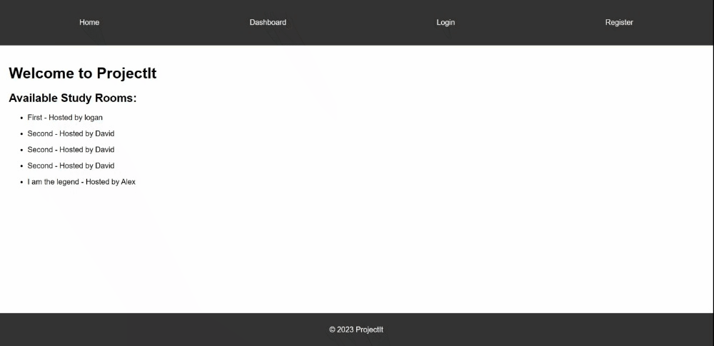

# ProjectIt 📚

_An interactive platform for students to create/join virtual study rooms, discuss topics, and share resources._

## Table of Contents

- [Overview](#overview)
- [Motivation](#motivation)
- [Features](#features)
- [Getting Started](#getting-started)
- [Usage](#usage)
- [Tech Stack](#tech-stack)
- [Deployment](#deployment)
- [Demo](#demo)
- [Contribute](#contribute)
- [License](#license)
- [Contact](#contact)

## Overview

ProjectIt aims to bridge the gap in online education by providing a platform where students can engage in group study sessions virtually.

## Motivation

With the rise of online education, many students miss out on the benefits of group study sessions. ProjectIt was developed to fill this void, allowing students to collaborate, discuss, and share resources.

## Features

- Create and join study rooms based on specific subjects or topics.
- Engage in discussions within study rooms.
- Share files, links, and other study resources.

**Features**

- User Authentication:
  - Register a new user.
  - Login using Passport authentication.
  - Logout.
- Study Rooms:
  - Create and join study rooms based on specific subjects or topics.
  - Fetch and return a list of all study rooms.
  - Fetch details of a specific study room based on its ID.
  - Send and receive messages within study rooms.

**Views**

- **Home Page**: Displays a list of all available study rooms.
- **Registration Page**: Allows new users to register.
- **Login Page**: Allows users to log in.
- **Dashboard**: A personalized dashboard for users, protected and only accessible to authenticated users.
- **Study Room**: Displays details and messages of a specific study room.

## Getting Started

1. Clone the repository.
2. Install dependencies using `npm install`.
3. Set up your `.env` file with the required environment variables:
   - `DB_USERNAME`: Your database username
   - `DB_PASSWORD`: Your database password
   - `DB_DATABASE`: Name of your database
   - `DB_HOST`: Your database host (e.g., localhost)
   - `SESSION_SECRET`: A secret string for session management (can be any string)
4. Run the application using `npm start`.

## Usage

Visit the deployed application on Heroku and sign up. Once logged in, you can create new study rooms or join existing ones.

## Tech Stack

- Node.js
- Express.js
- Handlebars.js
- MySQL with Sequelize ORM
- Socket.io

## Deployment

The application is deployed on Heroku. [Check it out!](https://safe-shore-77716-ee759ff77a7f.herokuapp.com/)

## Demo

## Contribute

Open to contributions. Please fork the repository and create a pull request with your changes.

## License

This project is licensed under the MIT License.

## Contact

- Arsalan Bardsiri - [arsalanbardsiri@gmail.com](mailto:arsalanbardsiri@gmail.com)

