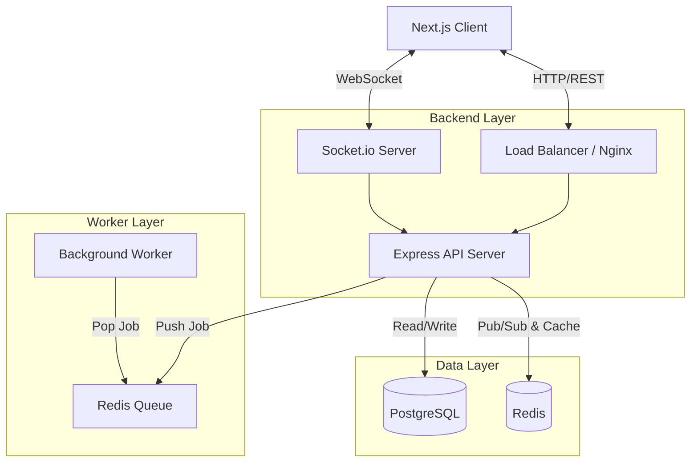

# ProjectIt V2 🚀

> A modern, distributed real-time study platform built with **Next.js**, **Express**, **TypeScript**, **Redis**, and **PostgreSQL**.


## 🌟 Overview

**ProjectIt V2** is a complete rewrite of a legacy Node.js application, designed to demonstrate **Senior Engineering** competencies in 2025. It transitions from a monolithic architecture to a scalable **Client-Server** model with distributed systems features.

### Key Features
-   **Real-time Collaboration**: WebSocket-based chat rooms powered by **Socket.io** and **Redis Adapter** for horizontal scaling.
-   **Distributed Job Queue**: Custom Redis-based message broker for handling background tasks (e.g., email notifications).
-   **Safety First**: Integrated profanity filtering to ensure a safe learning environment.
-   **Modern UI**: Built with **Next.js 14**, **Tailwind CSS**, and **Glassmorphism** design principles.
-   **Robust Backend**: **Express.js** with **TypeScript**, **Prisma ORM**, and **Zod** validation.

## 🏗️ Architecture

The application follows a **Microservices-ready** architecture:



### Tech Stack
-   **Frontend**: Next.js 14 (App Router), TypeScript, Tailwind CSS, Shadcn/UI concepts.
-   **Backend**: Node.js, Express.js, TypeScript.
-   **Database**: PostgreSQL (via Prisma ORM).
-   **Caching & Messaging**: Redis (Pub/Sub, Job Queue, Rate Limiting).
-   **DevOps**: Docker Compose, GitHub Actions (CI).

## ☁️ Deployment (The "Forever Free" Stack)

This project is deployed using a distributed multi-cloud strategy to maximize performance while remaining cost-effective:

| Component | Service | Role |
|-----------|---------|------|
| **Frontend** | [Vercel](https://vercel.com) | Next.js Edge Network & Hosting |
| **Backend** | [Render](https://render.com) | Node.js API Server |
| **Database** | [Supabase](https://supabase.com) | Managed PostgreSQL |
| **Redis** | [Upstash](https://upstash.com) | Serverless Redis for Pub/Sub & Queues |

See `deployment.md` for a detailed step-by-step guide on how to replicate this infrastructure.

## 🚀 Getting Started

### Prerequisites
-   Node.js (v18+)
-   Docker Desktop

### Installation

1.  **Clone the repository**
    ```bash
    git clone https://github.com/yourusername/projectit.git
    cd projectit
    ```

2.  **Start Infrastructure**
    ```bash
    docker-compose up -d
    ```

3.  **Setup Backend**
    ```bash
    cd server
    npm install
    npx prisma migrate dev --name init
    npm run dev
    ```

4.  **Setup Frontend**
    ```bash
    cd client
    npm install
    npm run dev
    ```

5.  **Visit App**: Open [http://localhost:3000](http://localhost:3000)

## 🛡️ Security & Performance
-   **Rate Limiting**: Custom Redis-based sliding window limiter on auth endpoints.
-   **Content Moderation**: `bad-words` filter on all real-time messages.
-   **Type Safety**: End-to-end TypeScript coverage.

## 🤝 Contributing
1.  Fork the Project
2.  Create your Feature Branch (`git checkout -b feature/AmazingFeature`)
3.  Commit your Changes (`git commit -m 'Add some AmazingFeature'`)
4.  Push to the Branch (`git push origin feature/AmazingFeature`)
5.  Open a Pull Request

## 📝 License
Distributed under the MIT License. See `LICENSE` for more information.
